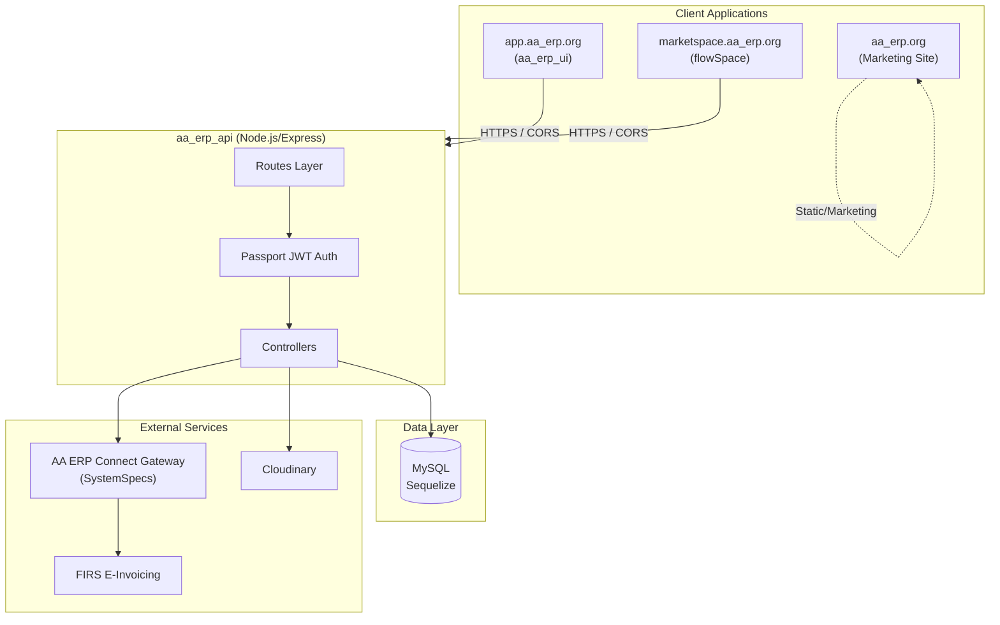
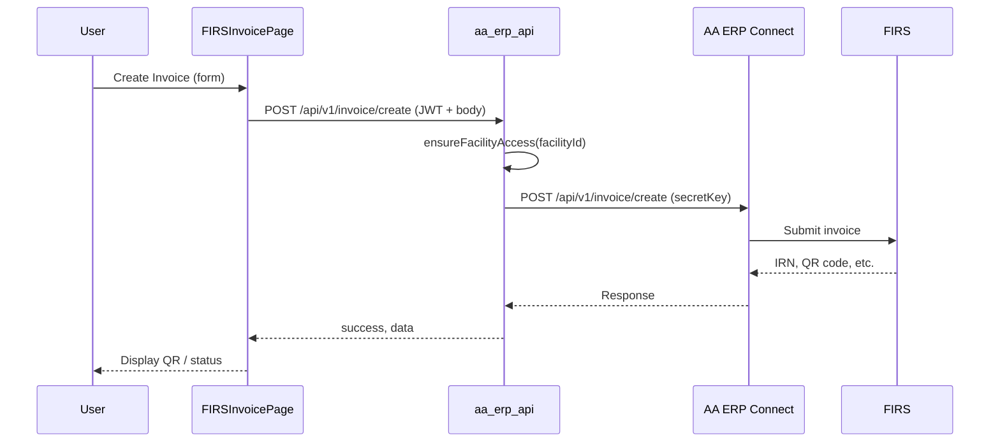
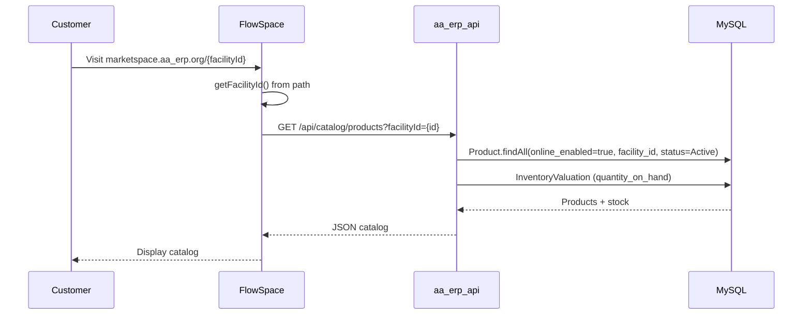
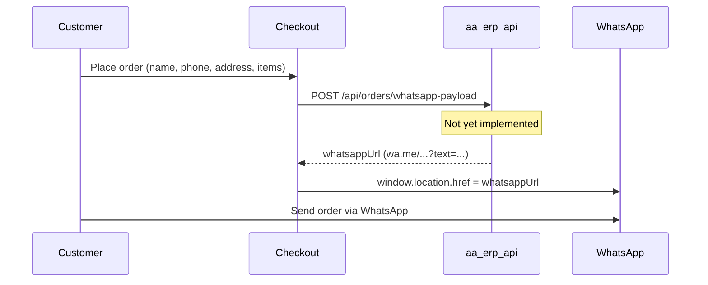
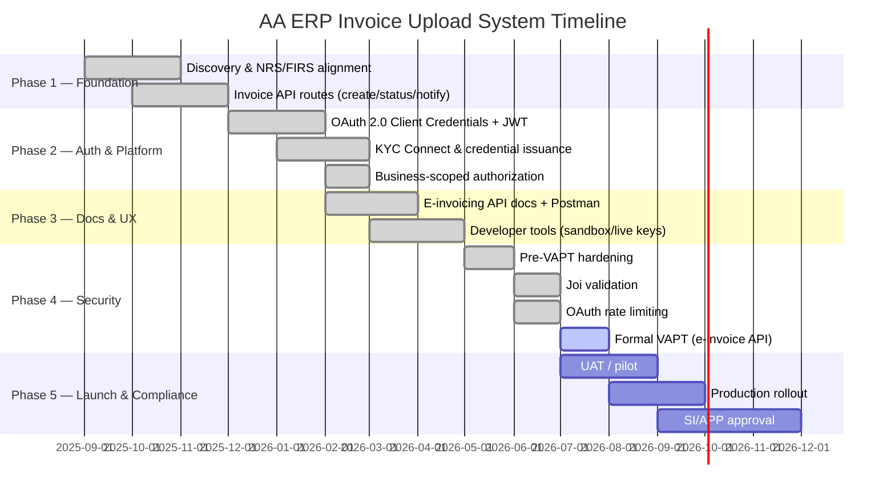

# AA ERP System Architecture

**Document Version:** 1.0
**Last Updated:** March 2025
**Scope:** AA ERP ecosystem – Main App, Marketplace (FlowSpace), API, and integrations

**Compliance:** Data compliance organization · Nigeria Data Protection Commission (NDPC) · ISO 27001 · ISO 9001

---

## 1. Executive Overview

AA ERP is a data compliance organization operating under Nigeria Data Protection Commission (NDPC) and certified to ISO 27001 and ISO 9001 standards. The platform provides:

- **Core ERP/CRM** – Inventory, sales, accounting, HR, production, and more
- **FIRS E-Invoicing** – Compliance with Nigeria’s Federal Inland Revenue Service e-Invoicing mandate via AA ERP Connect Gateway
- **Online Marketplace (FlowSpace)** – Public storefronts where customers browse products and place orders via WhatsApp

The system consists of multiple frontend applications, a shared Node.js/Express API, MySQL database, and external integrations (AA ERP Connect Gateway, Cloudinary, etc.).

---

## 2. High-Level Architecture Diagram



---

## 3. Application Components

### 3.1 Frontend Applications

| Application      | URL                                    | Tech Stack                          | Purpose                                                                    |
| ---------------- | -------------------------------------- | ----------------------------------- | -------------------------------------------------------------------------- |
| **aa_erp_ui** | app.aa_erp.org                      | React 18, Vite, Redux, React Router | Main dashboard: sales, inventory, HR, accounting, FIRS invoicing, settings |
| **flowSpace**    | marketspace.aa_erp.org/{facilityId} | React 19, TypeScript, Vite, Zustand | Public marketplace: catalog, cart, checkout → WhatsApp order               |
| **aa_erpweb** | aa_erp.org                          | React/HTML                          | Marketing and landing pages                                                |

### 3.2 Backend API (aa_erp_api)

| Property       | Value                                       |
| -------------- | ------------------------------------------- |
| **Framework**  | Express.js                                  |
| **Auth**       | Passport JWT (session: false)               |
| **ORM**        | Sequelize                                   |
| **Database**   | MySQL                                       |
| **Base Path**  | `/aa_erp` (configurable via `BASE_PATH`) |
| **Clustering** | Node cluster (optional, multi-CPU)          |

### 3.3 Key Backend Routes (AA ERP-Related)

| Route                                                           | Method | Auth | Purpose                               |
| --------------------------------------------------------------- | ------ | ---- | ------------------------------------- |
| `/api/v1/invoice/create`                                        | POST   | JWT  | Create invoice and submit to FIRS     |
| `/api/v1/invoice/status`                                        | POST   | JWT  | Lookup invoice status                 |
| `/api/v1/invoice/payment/notify`                                | POST   | JWT  | Notify payment status                 |
| `/api/catalog/products`                                         | GET    | None | Get products for marketplace (public) |
| `/account/update-online-ordering/:enabled/:facilityId/:user_id` | POST   | JWT  | Toggle online ordering for a facility |

---

## 4. Data Flow Diagrams

### 4.1 FIRS E-Invoicing Flow



**Authorization:** User must be authenticated and either:

- Own the `facilityId` in the request, or
- Have `role === "superAdmin"`

### 4.2 Marketplace (FlowSpace) Catalog Flow



### 4.3 Marketplace Checkout → WhatsApp Flow (Designed)



**Note:** `POST /api/orders/whatsapp-payload` and `POST /api/coupons/validate` are called by flowSpace but are **not yet implemented** in aa_erp_api.

---

## 5. Database Schema (AA ERP-Relevant)

| Model                  | Key Fields                                                                                      | AA ERP Use                                    |
| ---------------------- | ----------------------------------------------------------------------------------------------- | ------------------------------------------------ |
| **business**           | `id`, `enable_online_ordering`, `business_phone`                                                | Facility ID, marketplace toggle, WhatsApp number |
| **Product**            | `id`, `sku`, `online_enabled`, `selling_price`, `taxable`, `image_url`, `category`, `item_type` | Catalog visibility, pricing, stock               |
| **InventoryValuation** | `product_id`, `facility_id`, `quantity_on_hand`                                                 | Stock display in catalog                         |
| **User**               | `id`, `facilityId`, `role`                                                                      | JWT auth, facility-scoped access                 |

**Catalog filtering:**

- `facility_id` = facility
- `status` = `Active`
- `online_enabled` = `true`
- `item_type` ∈ `Finished Good`, `Resalable`, `Service`

---

## 6. Security Architecture

### 6.1 Authentication & Authorization

| Component            | Mechanism                                                                               |
| -------------------- | --------------------------------------------------------------------------------------- |
| **Main app**         | JWT via Passport (`passport.authenticate("jwt", { session: false })`)                   |
| **FIRS Invoice API** | JWT + `ensureFacilityAccess(req, facilityId)` – user must own facility or be superAdmin |
| **Catalog API**      | Public (no auth) – filtered by `facilityId` only                                        |

### 6.2 CORS

Allowed origins (default):

- `https://app.aa_erp.org`
- `https://marketspace.aa_erp.org`
- `http://localhost:42790`, `http://localhost:3000`, `http://localhost:5173`
- Additional via `CORS_ALLOWED_ORIGINS` env

### 6.3 VAPT & Security Notes

- VAPT completed for AA ERP Invoice API; High finding (VAPT-INV-001) remediated with JWT + facility-scoped auth
- Recommendations: rate limiting, restrict `/aa_erp-api-docs`, input validation, avoid exposing env details in errors

---

## 7. External Integrations

| Service                       | Purpose                               | Environment Variables                        |
| ----------------------------- | ------------------------------------- | -------------------------------------------- |
| **AA ERP Connect Gateway** | FIRS e-Invoicing proxy                | `AA_ERP_BASE_URL`, `AA_ERP_SECRET_KEY` |
| **Cloudinary**                | Image storage                         | Cloudinary config in app                     |
| **Email (SMTP)**              | Verification, password reset, invites | `COMPANY_EMAIL`, `COMPANY_WEBSITE`, etc.     |

**AA ERP Connect Gateway:**

- Base URL: `https://api-demo.systemspecsng.com/services/connect-gateway`
- Auth: `secretKey` header in requests

---

## 8. Environment Variables (AA ERP)

```env
# API
PORT=3000
BASE_PATH=/aa_erp
APP_URL=https://your-api-domain.com

# AA ERP
AA_ERP_BASE_URL=https://api-demo.systemspecsng.com/services/connect-gateway
AA_ERP_SECRET_KEY=your_aa_erp_secret_key_here

# Company
COMPANY_WEBSITE=https://aa_erp.org
COMPANY_EMAIL=hello@aa_erp.org
COMPANY_LOGO_URL=https://app.aa_erp.org/logo.png

# CORS (optional)
CORS_ALLOWED_ORIGINS=https://app.aa_erp.org,https://marketspace.aa_erp.org
```

---

## 9. API Documentation

| Document                  | URL                                                       | Scope                               |
| ------------------------- | --------------------------------------------------------- | ----------------------------------- |
| **Primary API docs**      | `{BASE_PATH}/api-docs`                                    | Full AaErp API                  |
| **AA ERP Invoice API** | `/aa_erp-api-docs` or `{BASE_PATH}/aa_erp-api-docs` | Create, Status, Payment Notify only |

---

## 10. Component File Map

### Backend (aa_erp_api)

| File                                  | Purpose                            |
| ------------------------------------- | ---------------------------------- |
| `src/app.js`                          | Express app, CORS, routes, Swagger |
| `src/routes/firsInvoice.js`           | FIRS invoice routes                |
| `src/routes/catalog.js`               | Catalog route                      |
| `src/controller/firsInvoice.js`       | Proxy to AA ERP Connect         |
| `src/controller/catalogController.js` | Catalog product logic              |
| `src/models/business.js`              | `enable_online_ordering`           |
| `src/models/products.js`              | `online_enabled`                   |
| `swagger.js`                          | `aa_erpInvoiceSpecs`            |

### Frontend – Main App (aa_erp_ui)

| File                                                                      | Purpose                                      |
| ------------------------------------------------------------------------- | -------------------------------------------- |
| `src/components/pages/payments/firs-invoice/FIRSInvoicePage.jsx`          | FIRS invoice hub                             |
| `src/components/pages/payments/firs-invoice/CreateInvoiceModal.jsx`       | Create invoice                               |
| `src/components/pages/payments/firs-invoice/LookupInvoiceStatusModal.jsx` | Lookup status                                |
| `src/components/pages/payments/firs-invoice/PaymentNotifyModal.jsx`       | Payment notification                         |
| `src/components/pages/admin/Settings.jsx`                                 | Marketplace link (marketspace.aa_erp.org) |
| `src/components/sidebars/AppSidebar.jsx`                                  | AA ERP branding                           |

### Frontend – Marketplace (flowSpace)

| File                     | Purpose                                                       |
| ------------------------ | ------------------------------------------------------------- |
| `src/App.tsx`            | Catalog, Cart, Checkout views                                 |
| `src/pages/Catalog.tsx`  | Product listing                                               |
| `src/pages/Cart.tsx`     | Cart                                                          |
| `src/pages/Checkout.tsx` | Checkout, WhatsApp redirect                                   |
| `src/api/catalog.ts`     | `GET /api/catalog/products`                                   |
| `src/api/orders.ts`      | `POST /api/orders/whatsapp-payload` (backend not implemented) |
| `src/api/coupons.ts`     | `POST /api/coupons/validate` (backend not implemented)        |
| `src/config.ts`          | `facilityId` from URL path                                    |

---

## 11. E-Invoicing / Invoice Upload System Implementation Timeline and Milestones

> Full standalone document (kept in sync for SI/APP / VAPT packs):
> [`UPLOAD_SYSTEM_IMPLEMENTATION_TIMELINE.md`](./UPLOAD_SYSTEM_IMPLEMENTATION_TIMELINE.md)
> Excel: [`Upload_System_Implementation_Timeline_and_Milestones.xlsx`](./Upload_System_Implementation_Timeline_and_Milestones.xlsx)

### 11.1 Overview

The AA ERP FIRS e-Invoicing **invoice upload** integration follows a phased implementation approach aligned with Nigeria’s FIRS mandate, NRS access-point capabilities, OAuth-secured APIs, and SI/APP compliance.

### 11.2 Implementation Timeline



### 11.3 Milestones

| ID       | Milestone                  | Status         | Description                                     |
| -------- | -------------------------- | -------------- | ----------------------------------------------- |
| **M1.1** | NRS/FIRS payload alignment | ✅ Complete    | Create/status/notify aligned to FIRS/NRS schema |
| **M1.2** | Invoice upload API         | ✅ Complete    | `/create`, `/status`, `/payment/notify`         |
| **M2.1** | OAuth 2.0 + JWT            | ✅ Complete    | Client Credentials → Bearer JWT                 |
| **M2.2** | Business-scoped access     | ✅ Complete    | Token `business_id` must match request          |
| **M2.3** | KYC Connect credentials    | ✅ Complete    | `fbk_test_` / `fbk_live_` issuance              |
| **M3.1** | API documentation          | ✅ Complete    | `/e-invoicing-api-docs` + Postman               |
| **M3.2** | Developer tools            | ✅ Complete    | NRS IDs + credential generate/view              |
| **M4.1** | App hardening              | ✅ Complete    | Helmet/HSTS/CSP, secret hygiene                 |
| **M4.2** | Joi validation             | ✅ Complete    | Create/status/notify; PARTIAL requires amount   |
| **M4.3** | OAuth rate limiting        | ✅ Complete    | ~20 failed / 15 min / IP on token               |
| **M4.4** | Formal VAPT                | 🔄 In progress | E-invoicing API scope                           |
| **M5.1** | UAT / pilot                | 🔲 Planned     | Sandbox pilot merchants                         |
| **M5.2** | Production rollout         | 🔲 Planned     | Live credentials + monitoring                   |
| **M5.3** | SI/APP approval            | 🔲 Planned     | FIRS SI / APP package                           |

### 11.4 Payment notify statuses

`PENDING`, `PAID`, `REJECTED`, `PARTIAL` (`amount` required for `PARTIAL`).

### 11.5 Dependencies and Risks

| Dependency                   | Impact                            |
| ---------------------------- | --------------------------------- |
| NRS Business ID / Service ID | IRN format + create authorization |
| OAuth client credentials     | Required for all upload API calls |
| Optional NRS upstream        | Live clearance when configured    |

| Risk                | Mitigation                   |
| ------------------- | ---------------------------- |
| Unauthorized upload | OAuth + business_id binding  |
| Invalid payloads    | Joi validation               |
| Token brute force   | Rate limit on `/oauth/token` |

---

## 12. Known Gaps & Future Work

1. **Orders/Coupons API** – flowSpace calls `/api/orders/whatsapp-payload` and `/api/coupons/validate`; these routes are not implemented in aa_erp_api.
2. **FlowSpace API base** – Uses `VITE_API_URL` (e.g. `http://localhost:42843`); production must point to the correct API.
3. **facilityId in orders** – `whatsapp-payload` will need `facilityId` (from URL or header) to resolve the business WhatsApp number.
4. **Invoice endpoint rate limiting** – Token endpoint limited; create/status/notify can add dedicated limiters if required post-VAPT.
5. **Swagger / docs protection** – Consider auth or IP allowlist for docs in production if assessors require it.

---

## 13. Deployment Overview

```
┌─────────────────────────────────────────────────────────────────────────┐
│                         PRODUCTION DEPLOYMENT                            │
├─────────────────────────────────────────────────────────────────────────┤
│                                                                         │
│  [app.aa_erp.org]          [marketspace.aa_erp.org]               │
│         │                                │                              │
│         └────────────┬───────────────────┘                             │
│                      │                                                  │
│                      ▼                                                  │
│              [Load Balancer / Reverse Proxy]                             │
│                      │                                                  │
│         ┌────────────┼────────────┐                                    │
│         ▼            ▼            ▼                                    │
│  [aa_erp_api]  [MySQL]  [AA ERP Connect]                       │
│  (Node cluster)      (DB)     (External)                                │
│                                                                         │
└─────────────────────────────────────────────────────────────────────────┘
```

---

_This document is derived from the AA ERP codebase and is intended for technical stakeholders and developers._
