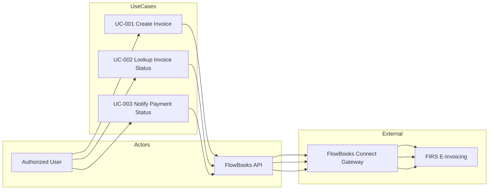

# FlowBooks E-Invoicing System Integration
## Proposed Use Cases

**Document Version:** 1.0  
**Last Updated:** March 2026  
**Scope:** FlowBooks FIRS e-Invoicing – System Integration Use Cases  
**Related:** FLOWBOOKS_SYSTEM_ARCHITECTURE.md, VAPT_REPORT_FlowBooks_Invoice_API.md

---

## 1. Introduction

This document describes the proposed use cases for the FlowBooks e-Invoice System Integration, which enables compliance with the Federal Inland Revenue Service (FIRS) e-Invoicing mandate in Nigeria. FlowBooks integrates with the FlowBooks Connect Gateway (SystemSpecs) to submit, query, and manage invoices in accordance with FIRS requirements.

---

## 2. Use Case Diagram (Overview)

---

## 3. Use Case Specifications

### UC-001: Create Invoice and Submit to FIRS

| Attribute | Description |
|-----------|--------------|
| **Use Case ID** | UC-001 |
| **Use Case Name** | Create Invoice and Submit to FIRS |
| **Actor(s)** | Authorized User (Facility Owner/Staff, Super Admin) |
| **Primary Actor** | Authorized User |
| **Stakeholders** | Facility, FIRS, FlowBooks Connect Gateway |

#### Brief Description
An authorized user creates an invoice with customer details, line items, and totals, and submits it to the FIRS e-Invoicing system via the FlowBooks Connect Gateway. Upon success, the system returns an Invoice Reference Number (IRN), QR code data, and transmission status.

#### Preconditions
- User is authenticated (valid JWT token).
- User has facility-scoped authorization (owns the facility or is Super Admin).
- Facility ID is valid and associated with the user.
- FlowBooks Connect Gateway is available.
- `FLOWBOOKS_SECRET_KEY` is configured in the environment.

#### Main Flow (Basic Flow)
1. User navigates to the FIRS Invoice page in the FlowBooks application.
2. User selects "Create Invoice" and opens the Create Invoice modal.
3. User enters invoice header data:
   - Invoice reference (e.g., INV-2024-001)
   - Facility ID
   - Currency (NGN)
   - Issue date (YYYY-MM-DD)
   - Due date (YYYY-MM-DD)
   - Status (e.g., "issued")
   - Invoice type (B2B, B2G, B2C, B2B/B2G, or Both B2B/B2G and B2C)
4. User enters customer details:
   - Customer ID (internal identifier)
   - Name (legal name)
   - Email (optional)
   - Phone (optional)
   - Address (line, city, country, postalZone)
   - TIN (Tax Identification Number, optional)
5. User adds line items:
   - Name, description
   - Unit price, quantity, total amount
   - Tax code (e.g., STANDARD_VAT), tax rate, tax amount
6. User enters or confirms totals (totalLineAmount, totalTax, grandTotal).
7. User submits the invoice.
8. System validates JWT and facility access.
9. System proxies the request to FlowBooks Connect Gateway with `secretKey`.
10. Gateway submits the invoice to FIRS.
11. System returns success with IRN, QR code data, issue_date, due_date, sync_date, payment_status, transmitted, delivered.

#### Alternative Flows
- **2a.** User saves a draft (if supported) and returns later to submit.
- **4a.** User selects an existing customer from the facility's customer list; system pre-fills customer details.

#### Exception Flows
- **E1.** User is not authenticated → System returns 401 Unauthorized.
- **E2.** User does not own the facility and is not Super Admin → System returns 403 Forbidden.
- **E3.** `FLOWBOOKS_SECRET_KEY` not configured → System returns 500 with message to configure environment.
- **E4.** Invalid payload (missing required fields) → Gateway returns 400; system forwards error to user.
- **E5.** Gateway or FIRS unavailable → System returns error; user may retry later.

#### Postconditions
- Invoice is created and transmitted to FIRS (if successful).
- Invoice record is associated with the facility.
- User receives IRN and QR code for embedding on printed/digital invoice.

#### Business Rules
- Invoice reference must be unique per facility.
- Currency is fixed as NGN for Nigerian compliance.
- Status "issued" indicates a finalized invoice.
- Customer address must include line, city, and country.

#### Related Use Cases
- UC-002 (Lookup Invoice Status) – to verify transmission
- UC-003 (Notify Payment Status) – to update payment state

---

### UC-002: Lookup Invoice Status

| Attribute | Description |
|-----------|--------------|
| **Use Case ID** | UC-002 |
| **Use Case Name** | Lookup Invoice Status |
| **Actor(s)** | Authorized User (Facility Owner/Staff, Super Admin) |
| **Primary Actor** | Authorized User |
| **Stakeholders** | Facility, FIRS, FlowBooks Connect Gateway |

#### Brief Description
An authorized user retrieves the status of an invoice previously submitted to FIRS by providing the facility ID and invoice reference. The system returns issue date, due date, sync date, payment status, and transmission/delivery flags.

#### Preconditions
- User is authenticated (valid JWT token).
- User has facility-scoped authorization.
- Invoice was previously created (via UC-001 or equivalent).

#### Main Flow (Basic Flow)
1. User navigates to the FIRS Invoice page.
2. User selects "Lookup Invoice Status" and opens the Lookup modal.
3. User enters:
   - Facility ID
   - Invoice reference (e.g., INV-2024-001)
4. User submits the lookup request.
5. System validates JWT and facility access.
6. System proxies the request to FlowBooks Connect Gateway.
7. Gateway queries FIRS for the invoice status.
8. System returns: issue_date, due_date, sync_date, payment_status (PENDING, PAID, REJECTED, PARTIAL), transmitted, delivered.

#### Alternative Flows
- **3a.** User selects facility from a dropdown (pre-populated with user's facility).
- **3b.** User enters invoice reference from a recent list or search.

#### Exception Flows
- **E1.** User is not authenticated → 401 Unauthorized.
- **E2.** User does not own the facility → 403 Forbidden.
- **E3.** Invoice not found → Gateway returns appropriate error; system forwards to user.
- **E4.** Gateway unavailable → System returns error; user may retry.

#### Postconditions
- User receives current invoice status from FIRS.
- User can take action (e.g., follow up on payment, update records) based on status.

#### Business Rules
- Lookup is read-only; no data modification.
- Only invoices belonging to the facility can be queried (enforced by authorization).

#### Related Use Cases
- UC-001 (Create Invoice) – prerequisite for lookup
- UC-003 (Notify Payment Status) – to update payment_status

---

### UC-003: Notify Payment Status

| Attribute | Description |
|-----------|--------------|
| **Use Case ID** | UC-003 |
| **Use Case Name** | Notify Payment Status |
| **Actor(s)** | Authorized User (Facility Owner/Staff, Super Admin) |
| **Primary Actor** | Authorized User |
| **Stakeholders** | Facility, FIRS, FlowBooks Connect Gateway |

#### Brief Description
An authorized user notifies the FIRS e-Invoicing system of a change in payment status for an invoice (PENDING, PAID, or REJECTED). This keeps FIRS records aligned with actual payment events.

#### Preconditions
- User is authenticated (valid JWT token).
- User has facility-scoped authorization.
- Invoice exists and was previously submitted to FIRS.

#### Main Flow (Basic Flow)
1. User navigates to the FIRS Invoice page.
2. User selects "Notify Payment Status" and opens the Payment Notify modal.
3. User enters:
   - Facility ID
   - Invoice reference (e.g., INV-2024-001)
   - Payment status (PENDING, PAID, or REJECTED)
4. User submits the notification.
5. System validates JWT and facility access.
6. System proxies the request to FlowBooks Connect Gateway.
7. Gateway notifies FIRS of the payment status update.
8. System returns success confirmation.

#### Alternative Flows
- **3a.** User selects invoice from a list of issued invoices.
- **3b.** User selects payment status from a dropdown (PENDING, PAID, REJECTED).

#### Exception Flows
- **E1.** User is not authenticated → 401 Unauthorized.
- **E2.** User does not own the facility → 403 Forbidden.
- **E3.** Invalid payment status → Gateway returns error; system forwards to user.
- **E4.** Invoice not found → Gateway returns error; system forwards to user.
- **E5.** Gateway unavailable → System returns error; user may retry.

#### Postconditions
- FIRS record is updated with the new payment status.
- Subsequent lookups (UC-002) will reflect the updated status.

#### Business Rules
- Payment status must be one of: PENDING, PAID, REJECTED.
- Notification is idempotent where appropriate (re-notifying same status may be allowed).

#### Related Use Cases
- UC-001 (Create Invoice) – prerequisite
- UC-002 (Lookup Invoice Status) – to verify updated status

---

## 4. Cross-Cutting Use Cases

### UC-004: Authenticate and Authorize User

| Attribute | Description |
|-----------|--------------|
| **Use Case ID** | UC-004 |
| **Use Case Name** | Authenticate and Authorize User |
| **Actor(s)** | User, FlowBooks API |
| **Includes** | UC-001, UC-002, UC-003 |

#### Brief Description
Before any invoice operation, the system authenticates the user via JWT and authorizes access to the requested facility. Only the facility owner or a Super Admin may perform invoice operations for that facility.

#### Main Flow
1. User sends request with JWT in `Authorization` header.
2. System validates JWT (signature, expiry).
3. System extracts user identity (userId, facilityId, role).
4. System checks facility access: user.facilityId === request.facilityId OR role === "superAdmin".
5. If allowed, request proceeds to invoice handler; otherwise, return 401 or 403.

---

### UC-005: Proxy Request to FlowBooks Connect Gateway

| Attribute | Description |
|-----------|--------------|
| **Use Case ID** | UC-005 |
| **Use Case Name** | Proxy Request to FlowBooks Connect Gateway |
| **Actor(s)** | FlowBooks API, FlowBooks Connect Gateway |
| **Includes** | UC-001, UC-002, UC-003 |

#### Brief Description
The FlowBooks API acts as a secure proxy between the client and the FlowBooks Connect Gateway. It adds the `secretKey` header and forwards the request; it does not expose the secret to the client.

#### Main Flow
1. API receives validated request from invoice handler.
2. API maps `facilityId` to `merchantId` (if required by gateway).
3. API sends request to Gateway with `secretKey` header.
4. API receives response and forwards to client (success or error).

---

## 5. API Endpoint Summary

| Use Case | HTTP Method | Endpoint | Auth |
|----------|-------------|----------|------|
| UC-001 | POST | `/api/v1/invoice/create` | JWT + facility |
| UC-002 | POST | `/api/v1/invoice/status` | JWT + facility |
| UC-003 | POST | `/api/v1/invoice/payment/notify` | JWT + facility |

---

## 6. Data Models (Key Entities)

### Invoice Create Request
- `invoiceRef`, `facilityId`, `currency`, `issueDate`, `dueDate`, `status`, `type`
- `customer`: `customerId`, `name`, `email`, `phone`, `identifiers.tin`, `address`
- `lineItems`: `name`, `description`, `unitPrice`, `quantity`, `totalAmount`, `taxCode`, `taxRate`, `taxAmount`
- `totals`: `totalLineAmount`, `totalTax`, `grandTotal`

### Invoice Status Request
- `facilityId`, `invoiceRef`

### Payment Notify Request
- `facilityId`, `invoiceRef`, `paymentStatus` (PENDING | PAID | REJECTED)

---

## 7. Glossary

| Term | Definition |
|------|-------------|
| **FIRS** | Federal Inland Revenue Service (Nigeria) |
| **IRN** | Invoice Reference Number – unique identifier from FIRS |
| **FlowBooks Connect Gateway** | SystemSpecs gateway for FIRS e-Invoicing |
| **B2B** | Business-to-Business |
| **B2G** | Business-to-Government |
| **B2C** | Business-to-Consumer |
| **TIN** | Tax Identification Number |
| **JWT** | JSON Web Token (authentication) |

---

## 8. References

- [FLOWBOOKS_SYSTEM_ARCHITECTURE.md](./FLOWBOOKS_SYSTEM_ARCHITECTURE.md) – System architecture and data flows
- [VAPT_REPORT_FlowBooks_Invoice_API.md](./VAPT_REPORT_FlowBooks_Invoice_API.md) – Security assessment
- Swagger UI: `/flowbooks-api-docs` or `{BASE_PATH}/flowbooks-api-docs`

---

*This document is intended for FIRS e-Invoicing system integration, compliance documentation, and developer reference.*
