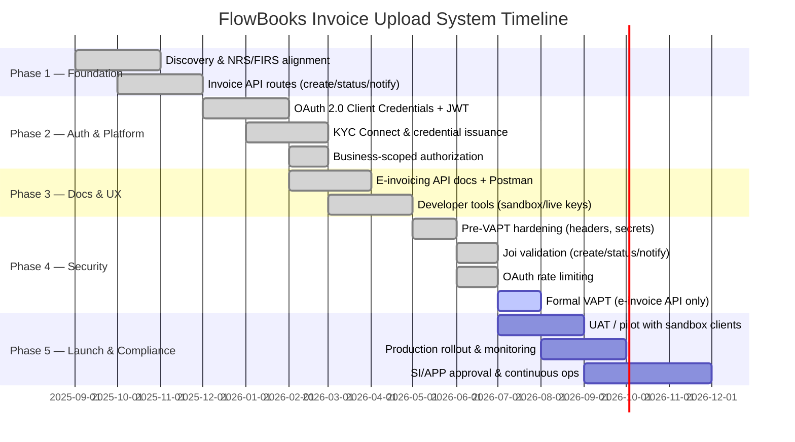

# FlowBooks Invoice Upload System — Implementation Timeline and Milestones

**Document:** Upload / E-Invoicing System Implementation Timeline  
**Product:** FlowBooks FIRS / NRS E-Invoicing API  
**API base:** `https://server.brainstorm.ng/inventria_new`  
**Docs:** `/e-invoicing-api-docs`  
**Last updated:** July 2026

---

## 1. Overview

FlowBooks implements an **invoice upload system** that allows System Integrator (SI) / Access Point clients to:

1. Authenticate via OAuth 2.0 Client Credentials  
2. **Upload / create** invoices (`POST /api/v1/invoice/create`)  
3. Look up invoice status (`POST /api/v1/invoice/status`)  
4. Notify payment status (`POST /api/v1/invoice/payment/notify`) — `PENDING` | `PAID` | `REJECTED` | `PARTIAL`

The implementation follows a phased approach aligned with FIRS e-Invoicing requirements, NRS access-point integration, security (VAPT), and SI/APP compliance.

---

## 2. Implementation Timeline (Gantt)

---

## 3. Milestones

| ID | Phase | Milestone | Target | Status | Description |
|----|-------|-----------|--------|--------|-------------|
| M1.1 | Foundation | NRS/FIRS payload alignment | Nov 2025 | ✅ Complete | Align create/status/notify with FIRS/NRS e-invoicing schema (IRN, parties, lines, tax, monetary totals). |
| M1.2 | Foundation | Invoice upload API live | Dec 2025 | ✅ Complete | `POST /api/v1/invoice/create`, `/status`, `/payment/notify` implemented and deployable. |
| M2.1 | Auth | OAuth 2.0 + JWT | Feb 2026 | ✅ Complete | Client Credentials token endpoint; Bearer JWT on invoice routes. |
| M2.2 | Auth | Business-scoped access | Mar 2026 | ✅ Complete | OAuth client bound to NRS `business_id`; mismatch returns 403. |
| M2.3 | Platform | KYC Connect credentials | Mar 2026 | ✅ Complete | Sandbox (`fbk_test_`) / production (`fbk_live_`) credential issuance after KYC. |
| M3.1 | Docs | Public API documentation | Apr 2026 | ✅ Complete | `/e-invoicing-api-docs`, OpenAPI JSON, Postman collection. |
| M3.2 | Docs | Developer tools UI | May 2026 | ✅ Complete | NRS Business/Service ID save; generate/view OAuth credentials. |
| M4.1 | Security | App hardening | Jun 2026 | ✅ Complete | Helmet/HSTS/CSP, secret hygiene, production logging controls. |
| M4.2 | Security | Request validation | Jul 2026 | ✅ Complete | Joi schemas for create, status, payment notify; `payment_status`: PENDING, PAID, REJECTED, PARTIAL. |
| M4.3 | Security | Rate limiting (token) | Jul 2026 | ✅ Complete | OAuth token: ~20 failed attempts / 15 min / IP. |
| M4.4 | Security | Formal VAPT | Jul–Aug 2026 | 🔄 In progress | Third-party VAPT scoped to e-invoicing API only. |
| M5.1 | Launch | UAT / pilot | Jul–Sep 2026 | 🔲 Planned | Pilot merchants with sandbox upload; validate IRN, status, partial payment notify. |
| M5.2 | Launch | Production rollout | Aug–Oct 2026 | 🔲 Planned | Live credentials, monitoring, optional NRS upstream transmission. |
| M5.3 | Compliance | SI/APP approval | Sep–Dec 2026 | 🔲 Planned | Complete FIRS SI / Access Point Provider approval package. |

---

## 4. Phase Details

### Phase 1 — Foundation (Sep–Dec 2025)
- Define invoice upload contract (create / status / payment notify).  
- Persist local records for SI sandbox acceptance when upstream is unset.  
- Optional proxy to NRS/FIRS access point via `FIRS_EINVOICE_BASE_URL`.

### Phase 2 — Authentication & Platform (Dec 2025 – Mar 2026)
- OAuth 2.0 Client Credentials → JWT Bearer.  
- KYC Connect for merchant onboarding and credential lifecycle (rotate/reveal).  
- Bind clients to NRS Business ID for multi-tenant isolation.

### Phase 3 — Documentation & Developer Experience (Feb–May 2026)
- Publish interactive docs and Postman.  
- Developer tools for NRS IDs and sandbox/live keys.

### Phase 4 — Security & Assurance (May–Aug 2026)
- Secure headers, env-based secrets, Joi validation.  
- Token endpoint rate limiting.  
- Formal VAPT on e-invoicing API; remediate findings.

### Phase 5 — Launch & Compliance (Jul–Dec 2026)
- UAT with pilot clients.  
- Production enablement after KYC approval.  
- SI/APP regulatory submission and ongoing operations.

---

## 5. In-Scope Upload APIs

| Method | Endpoint | Purpose |
|--------|----------|---------|
| POST | `/api/v1/invoice/oauth/token` | Obtain access token |
| POST | `/api/v1/invoice/create` | **Upload / create invoice** |
| POST | `/api/v1/invoice/status` | Lookup clearance / payment status |
| POST | `/api/v1/invoice/payment/notify` | Update payment status |

**Payment status values:** `PENDING`, `PAID`, `REJECTED`, `PARTIAL`  
(`PARTIAL` requires `amount`.)

---

## 6. Dependencies and Risks

| Dependency | Impact |
|------------|--------|
| NRS Business ID / Service ID | Required for IRN format and create authorization |
| OAuth client credentials | Required for all upload API calls |
| Optional NRS upstream URL | Live clearance transmission when configured |
| TLS / reverse proxy | HTTPS termination; trust proxy for secure cookies/headers |

| Risk | Mitigation |
|------|------------|
| Unauthorized upload | OAuth + business_id binding |
| Invalid payloads | Joi validation with structured `details` |
| Token brute force | Rate limit on `/oauth/token` |
| Upstream outage | Local accept/store in SI sandbox mode; retry/ops runbooks for live |

---

## 7. Current Status Summary (July 2026)

| Area | Status |
|------|--------|
| Invoice upload API (create) | ✅ Live |
| Status & payment notify | ✅ Live |
| OAuth / JWT | ✅ Live |
| API documentation | ✅ Live |
| Validation & rate limit (token) | ✅ Live |
| Formal VAPT | 🔄 In progress |
| Production pilot / SI approval | 🔲 Planned |

---

*This document may be submitted as part of the FlowBooks SI/APP / VAPT evidence pack for the FIRS e-Invoicing invoice upload capability.*
